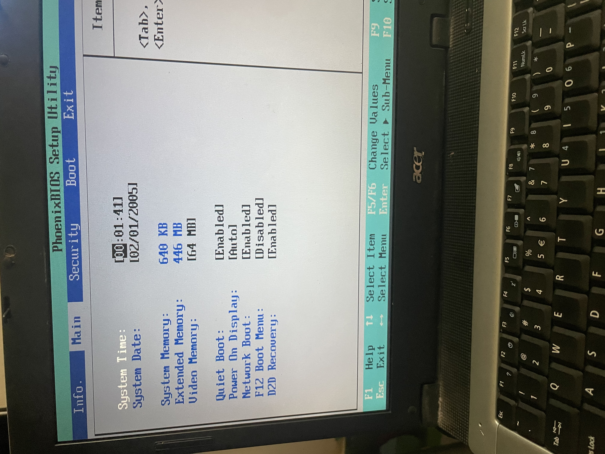
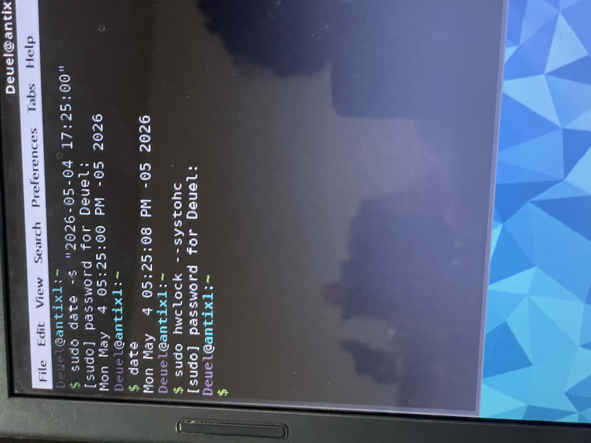
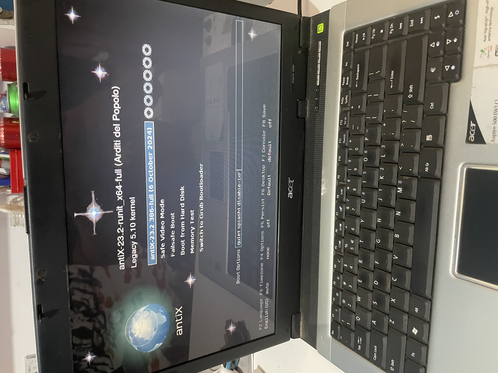
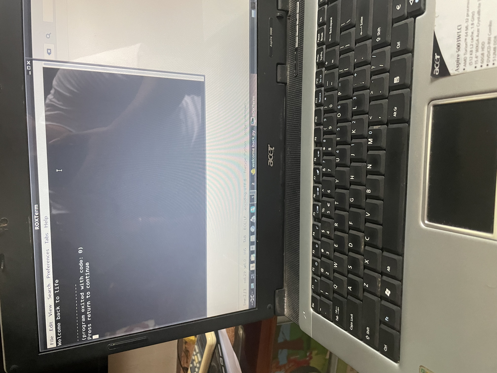

# Reviving a 2005 Laptop with antiX Linux

> *Running a fully functional Linux environment on hardware that predates YouTube.*

---

## The Challenge

My mother's old **Acer Aspire 5000** had been sitting unused for years not because it was broken, but because Windows had made it completely unusable. I decided to bring it back to life as a personal engineering challenge.

**Hardware specs (2005):**
| Component | Spec |
|-----------|------|
| CPU | AMD Turion 64 ML-32 @ 1800 MHz |
| RAM | 512 MB (446 MB usable and 64 MB reserved by GPU) |
| BIOS | PhoenixBIOS (legacy, no UEFI) |
| Model | Acer Aspire 5000 |

446 MB of usable RAM!!. In 2026. Challenge accepted.

---

## Why antiX?

After researching lightweight Linux distros, I ruled out:
- **Lubuntu / Xubuntu** → still too heavy for <512MB RAM
- **Puppy Linux** → limited package ecosystem
- **Debian minimal** → viable, but no built-in optimizations for legacy hardware

**antiX** was the right choice because:
- Systemd-free (massive RAM savings at boot)
- Built specifically for old hardware
- Active community, real package support
- Ships with lightweight window managers (IceWM, FluxBox)

---

## Problem 1: Dead CMOS Battery → Clock Reset on Every Boot

The laptop's CMOS battery was dead, meaning the hardware clock reset to `02/01/2005 00:01:41` every time it powered on. This broke package managers, SSL certificates, and basically anything time-dependent.

**Before (BIOS on every boot):**



### Solution

Since replacing the CMOS battery wasn't an option, I automated the clock sync using NTP at startup and documented the manual fix:

```bash
# Set system time manually
sudo date -s "YYYY-MM-DD HH:MM:SS"

# Sync to hardware clock
sudo hwclock --systohc

# Verify
date
```

**After (correct time synced from terminal):**



For a permanent fix, I configured NTP to sync automatically on every network connection:

```bash
# Install chrony (lightweight NTP client)
sudo apt-get install chrony

# Enable and start the service
sudo systemctl enable chrony
sudo systemctl start chrony

# Verify sync
chronyc tracking
```

---

## Problem 2: RAM Optimization (446 MB is not a lot)

With only 446 MB of usable RAM, every megabyte counts. Here's what I did to keep the system responsive:

```bash
# Check current RAM usage
free -h

# Enable zram (compressed swap in RAM — faster than disk swap)
sudo apt-get install zram-tools
sudo systemctl enable zramswap
sudo systemctl start zramswap

# Disable unused services to free RAM
sudo systemctl disable bluetooth
sudo systemctl disable cups        # printing service
sudo systemctl disable avahi-daemon

# Check what's eating RAM
ps aux --sort=-%mem | head -15
```

**Result:** System boots into a usable desktop with ~120–140 MB RAM used. Enough headroom to run a browser, terminal, and text editor simultaneously.

---

## What I Learned

- **Distro selection matters** — the right tool for the constraints. antiX's systemd-free architecture saved ~40–60 MB of RAM at boot compared to systemd-based alternatives.
- **Hardware constraints force you to understand the system** — when you only have 446 MB, you learn what every process actually does.
- **Debugging without Stack Overflow** — most answers for a 2005 laptop aren't on the first page of Google. You learn to read man pages and think from first principles.
- **`hwclock --systohc`** — one command, solves a problem that would have confused most people used to modern hardware.

---

## Hardware Photos

**1. The problem — clock stuck in 2005 on every boot:**


**2. The installation — antiX bootloader on a 2005 machine:**



**3. The fix — syncing the hardware clock from terminal:**


**4. The result:**



---

## Repo Structure

```
antiX-legacy-revival/
├── README.md
├── photos/
│   ├── bios-date-reset.jpeg
│   ├── antix-bootloader.jpeg
│   ├── terminal-date-fix.jpeg
│   └── welcome-back-to-life.jpeg
└── scripts/
    ├── fix-clock.sh
    └── optimize-ram.sh
```

---

## Scripts

### `fix-clock.sh`
```bash
#!/bin/bash
# Quick clock fix for dead CMOS battery
# Usage: sudo ./fix-clock.sh "2026-01-15 14:30:00"

if [ -z "$1" ]; then
  echo "Usage: sudo ./fix-clock.sh \"YYYY-MM-DD HH:MM:SS\""
  exit 1
fi

sudo date -s "$1"
sudo hwclock --systohc
echo "Clock synced: $(date)"
```

### `optimize-ram.sh`
```bash
#!/bin/bash
# RAM optimization for legacy hardware (<512MB)

echo "=== RAM before optimization ==="
free -h

# Enable zram
sudo apt-get install -y zram-tools
sudo systemctl enable zramswap && sudo systemctl start zramswap

# Disable non-essential services
SERVICES=("bluetooth" "cups" "avahi-daemon")
for service in "${SERVICES[@]}"; do
  sudo systemctl disable "$service" 2>/dev/null && echo "Disabled: $service"
done

echo ""
echo "=== RAM after optimization ==="
free -h
```

---

*Built out of curiosity. Runs antiX Linux. Still works in 2026.*
